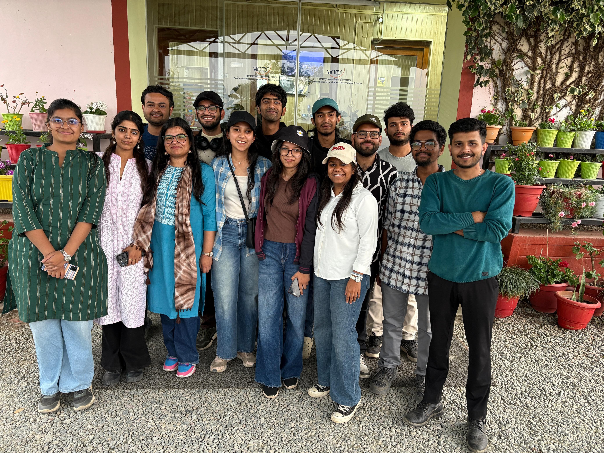
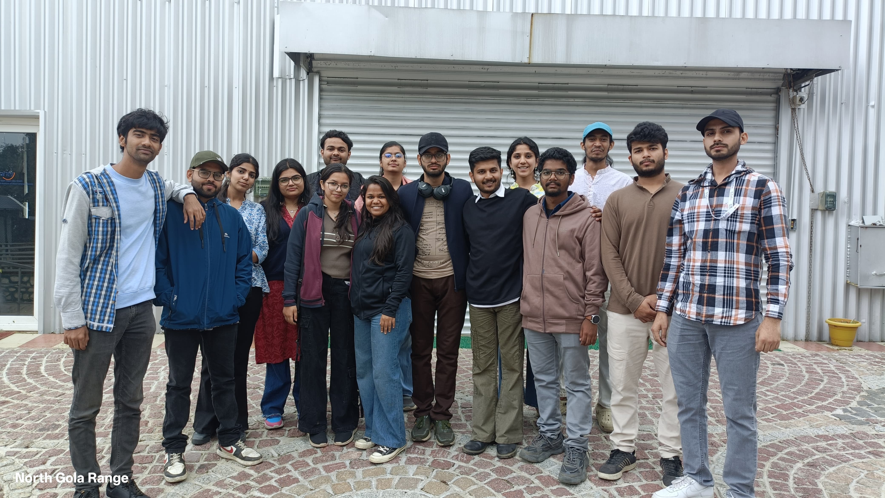
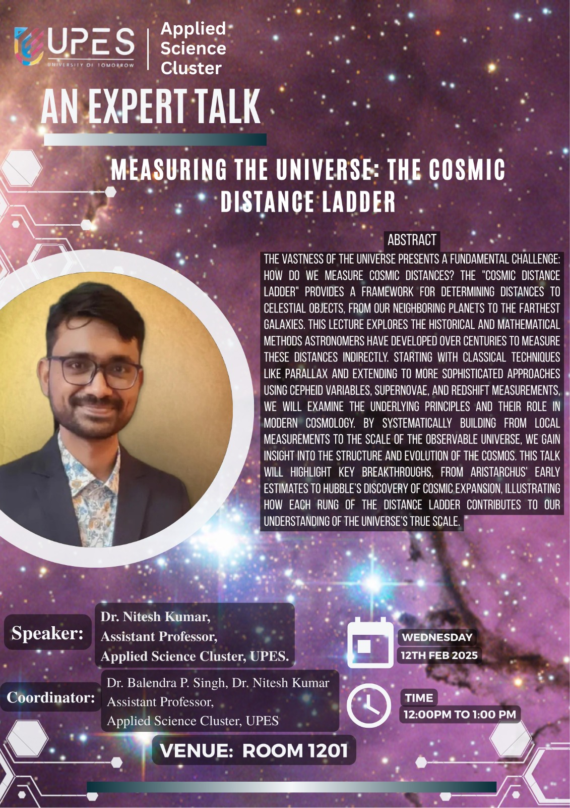
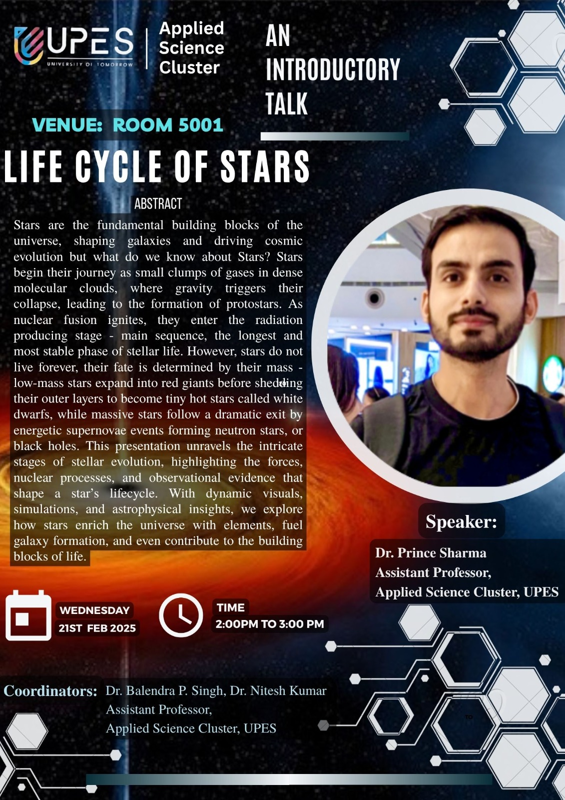
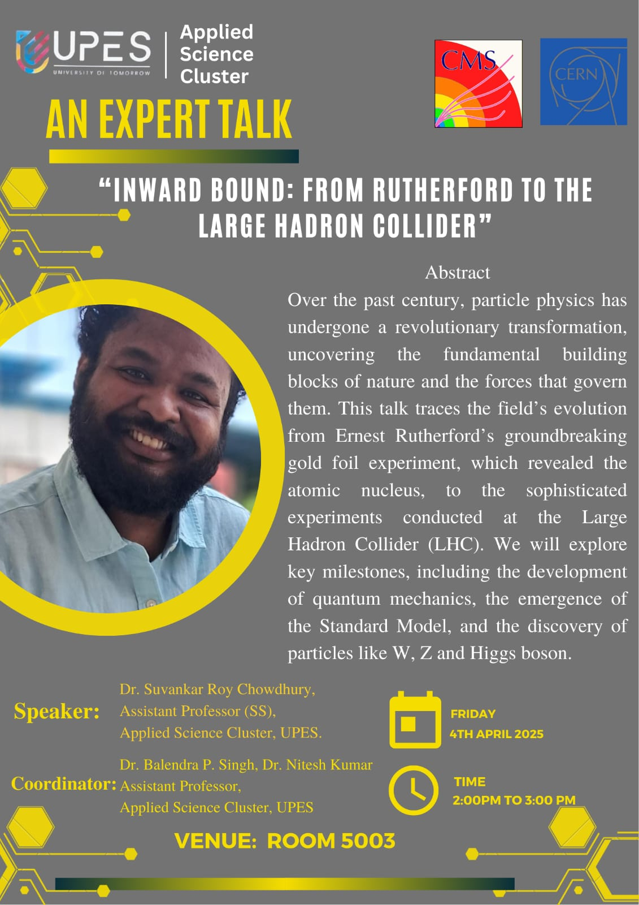
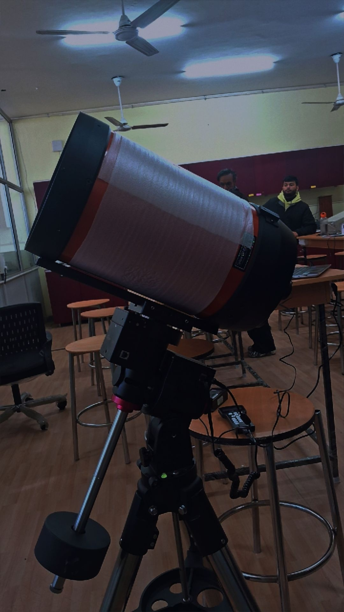
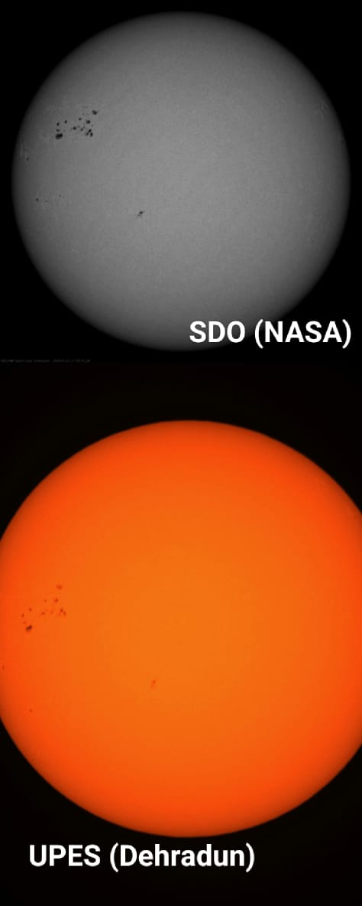
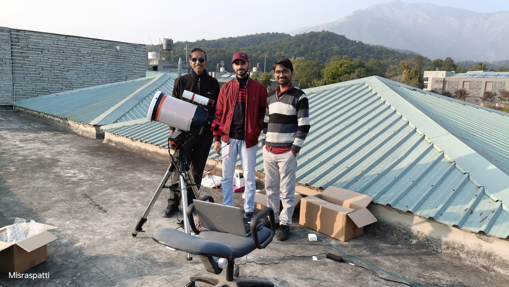

# Recent Activities

**April 2025:** Student Visit to ARIES, Nainital

As part of our continued efforts to expose students to real-world astronomical research and facilities, a group of undergraduate students undertook a memorable academic expedition to the **Aryabhatta Research Institute of Observational Sciences (ARIES)**, Nainital.

This educational visit provided a rare opportunity for students to interact directly with **professional astronomers, scientists, and engineers**, gaining firsthand insights into India's leading research programs in observational astronomy. The visit featured a series of informative sessions delivered by ARIES researchers, covering topics such as exo-planet detection methods, Solar dynamics, and observational strategies, and the scientific goals of ongoing national missions.

A major highlight of the trip was the excursion to **Devasthal**, one of India’s premier observational sites. Students toured all three cutting-edge telescopes located there:
- The **3.6-meter Devasthal Optical Telescope (DOT)** – India’s largest optical telescope (Largest in Asia) and a vital asset for deep-sky observations.
- The **1.3-meter Devasthal Fast Optical Telescope (DFOT)** – designed for rapid follow-up observations.
- The **International Liquid Mirror Telescope (ILMT)** – the first liquid mirror telescope dedicated exclusively to astronomical research.
The experience not only broadened the students’ understanding of observational astrophysics but also inspired many to envision a future in astronomical instrumentation and research. The exposure to operational observatories and interactions with the scientific community at ARIES made this visit a milestone in their academic journey.

**A glance into the visit:**

  
  
  
  
  

**March 2025:** Weekly Lecture Series on Astrophysics initiated.

The *Weekly Lecture Series on Astrophysics* is an ongoing academic initiative aimed at introducing students to the fascinating world of astronomy and astrophysics. Open to all, regardless of academic background, the series offers a welcoming platform for anyone curious about the universe to engage with foundational and contemporary topics in the field.

Designed for a general audience, the lectures explore diverse themes including **stellar evolution**, **black hole physics**, and **modern observational techniques**, providing attendees with valuable insights into current astrophysical research. The goal is to spark curiosity and foster interdisciplinary engagement among students from all walks of academia.

The series is led by experts in the field, and so far has featured engaging lectures by:
- **Dr. Balendra P. Singh**
- **Dr. Nitesh Kumar**
- **Dr. Prince Sharma**
- **Dr. Arka Chatterjee**
- **Dr. Suvankar R. Chowdhury**
- **Dr. Raju RoyChowdhury**

  

    
    
Lecture 2 by Dr. Nitesh Kumar on "<em>Measuring the Universe: The Cosmic Ladder</em>"

  

  

    
    
Lecture 3 by Dr. Prince Sharma on "<em>Life Cycle of Stars</em>"

  

  

    
    
Lecture 5 by Dr. Suvankar R. Chowdhury on "<em> Inward Bound: From Rutherford to Large Hadron Collider</em>"

  

<!-- 
<strong>Note:</strong> Lecture 1 by Dr. Balendra P. Singh, Lecture 4 by Dr. Arka Chatterjee, and Lecture 6 by Dr. Raju Sah were also delivered as part of the series.
 -->

**February 2025:** Sky-Gazing Event with In-House 12-inch Telescope

As part of our hands-on engagement in observational astronomy, a **sky-gazing session** was organized using the department’s in-house **12-inch reflector telescope**, giving students a rare opportunity to explore the skies from right here on campus.

The event featured a **guided solar observation** session during the day, where students safely viewed the **Sun through a solar filter**, observing sunspots and experiencing the dynamic nature of our nearest star. Faculty members guided participants in operating the telescope and understanding solar features, fostering curiosity through real-time observation.

For many attendees, this was their **first direct glimpse at the Sun through a scientific instrument**, turning abstract concepts into vivid, observable reality. The session highlighted the importance of practical astronomy and left students excited for more night-sky viewing events to follow.

  
  
  

