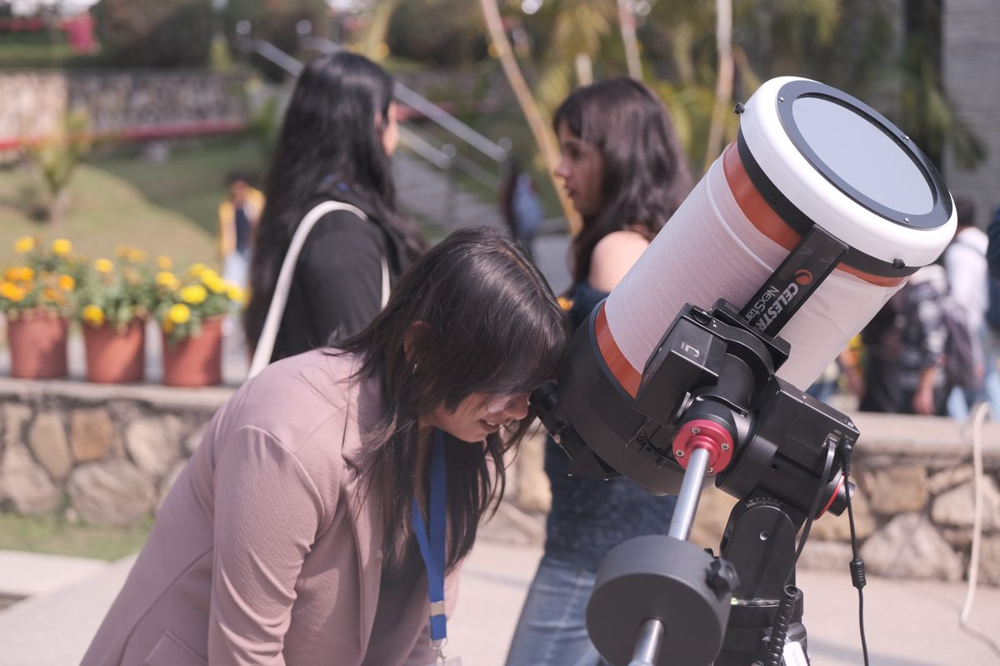
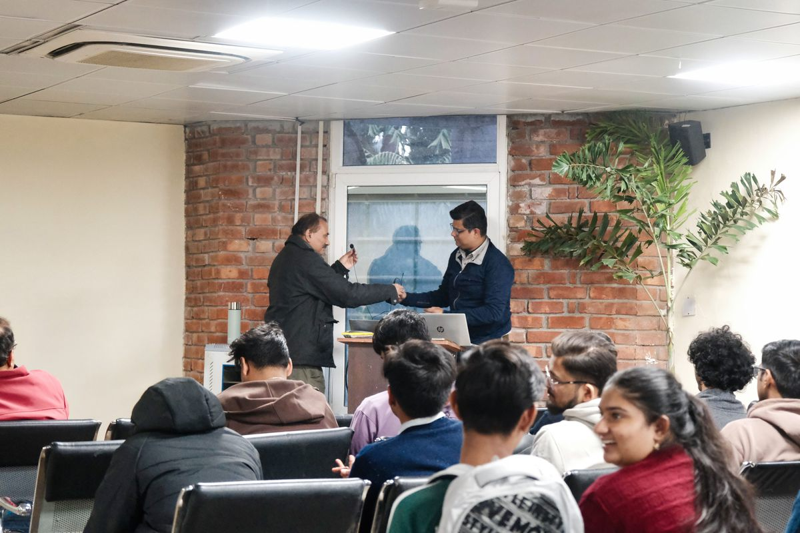
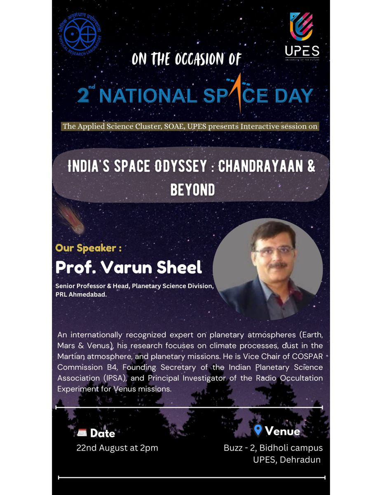
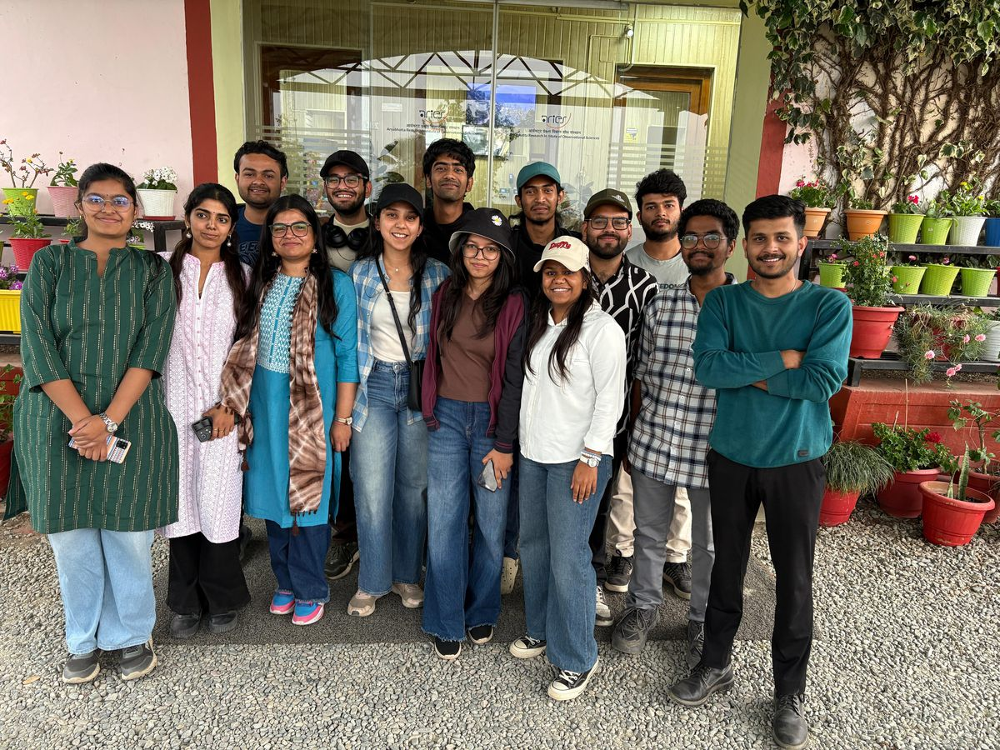
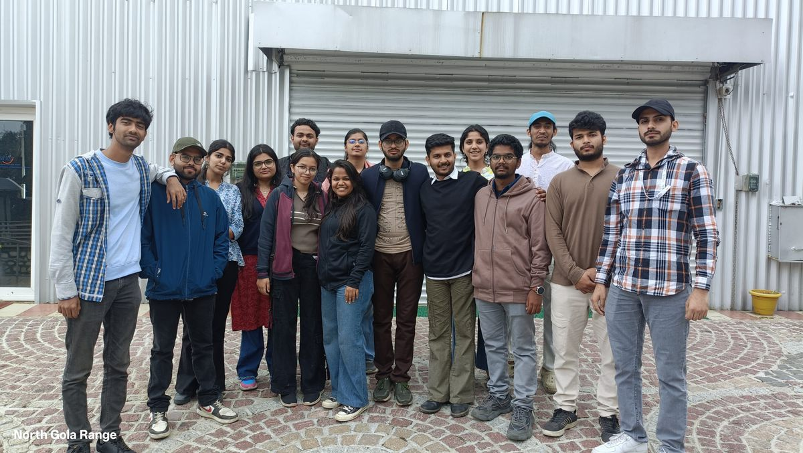
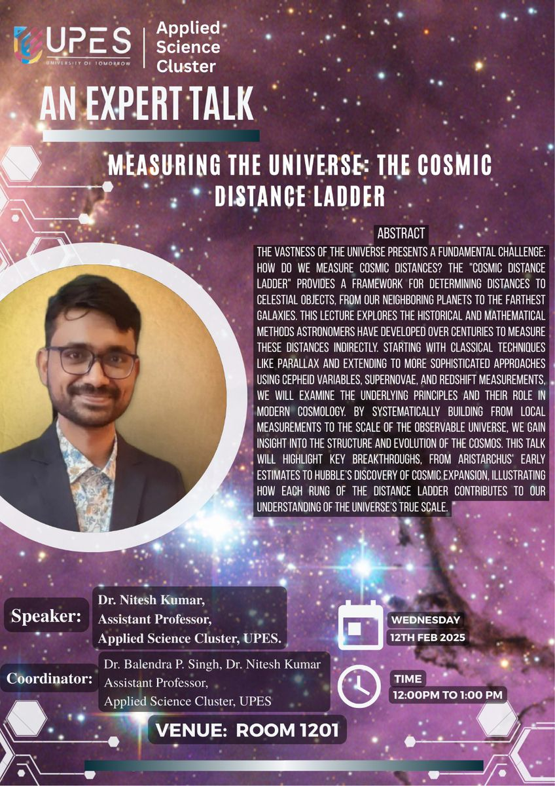
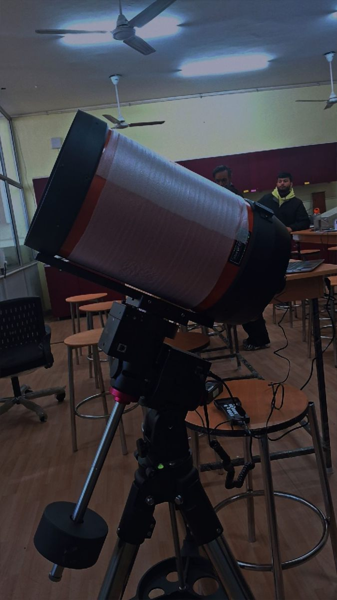
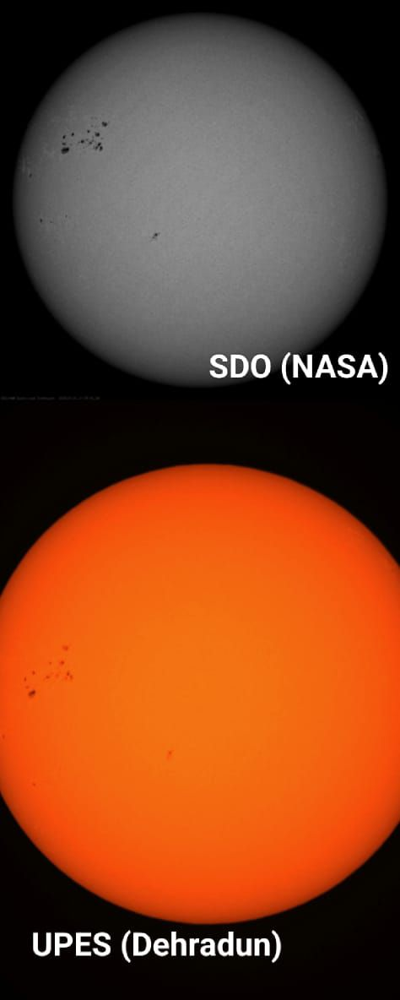
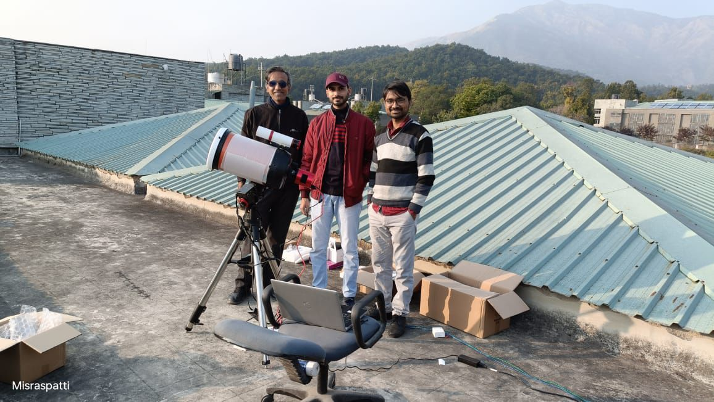

# 🚀 Recent Activities

---

## 🎓 February 2026: National Workshop on Data Science in Astronomy (Success Story)

The **National Workshop on Data Science in Astronomy (NWDSA)** was successfully organized at **UPES, Dehradun** from **24-26 February 2026** with academic support from IUCAA and active participation from students, faculty, and early-career researchers.

The workshop blended keynote lectures, guided hands-on labs, and participant-led project/presentation sessions. Participants worked with real astronomical datasets and strengthened practical skills in data handling, visualization, and time-series analysis.

**Workshop impact and outcomes:**
- Strong interdisciplinary participation from physics, astronomy, mathematics, and computer science backgrounds.
- Successful completion of hands-on sessions using Python-based scientific tools.
- Active poster and project discussions that encouraged collaborative learning.
- Valuable research networking between participants, speakers, and organizing faculty.

  

    <strong>Event:</strong> National Workshop on Data Science in Astronomy 
    <strong>Dates:</strong> 24th - 26th February 2026 
    <strong>Venue:</strong> UPES, Dehradun 
    <strong>Format:</strong> Talks + Hands-on + Project/Poster sessions 
    <strong>Status:</strong> Successfully completed
  

  

    

      

        
        
        <button onclick="prevNwdsaSlide()" aria-label="Previous Slide" style="position: absolute; top: 50%; left: 10px; transform: translateY(-50%); background: rgba(0,0,0,0.5); color: #fff; border: none; border-radius: 50%; width: 34px; height: 34px; cursor: pointer;">&#8592;</button>
        <button onclick="nextNwdsaSlide()" aria-label="Next Slide" style="position: absolute; top: 50%; right: 10px; transform: translateY(-50%); background: rgba(0,0,0,0.5); color: #fff; border: none; border-radius: 50%; width: 34px; height: 34px; cursor: pointer;">&#8594;</button>
      

      
Highlights from the National Workshop on Data Science in Astronomy (NWDSA 2026).

    

  

 

---

## 🌙 December 2025: Night Sky Observation (NSO) Event

The **Night Sky Observation (NSO)** event was conducted on **2nd December 2025**, offering students and enthusiasts a direct observational astronomy experience under the evening sky.

Participants observed key celestial targets through telescope-guided sessions and received live explanations on sky navigation, star identification, and observation practices. The event successfully connected classroom astronomy with real-sky exploration.

**Event details:**
- **Date:** 2nd December 2025
- **Format:** Guided night observation + faculty interaction
- **Focus:** Telescope orientation, constellation tracking, and practical sky awareness
- **Outcome:** Strong student engagement and hands-on observational confidence

  

    
    
    <button onclick="prevNsoSlide()" aria-label="Previous NSO slide" style="position: absolute; top: 50%; left: 10px; transform: translateY(-50%); background: rgba(0,0,0,0.5); color: #fff; border: none; border-radius: 50%; width: 34px; height: 34px; cursor: pointer;">&#8592;</button>
    <button onclick="nextNsoSlide()" aria-label="Next NSO slide" style="position: absolute; top: 50%; right: 10px; transform: translateY(-50%); background: rgba(0,0,0,0.5); color: #fff; border: none; border-radius: 50%; width: 34px; height: 34px; cursor: pointer;">&#8594;</button>
  

  
Moments from the Night Sky Observation event at UPES.

 

---

## 🛰️ August 2025: National Space Day 2025 Event

On the occasion of the 2nd National Space Day, **Prof. Varun Sheel** (Head, Planetary Science Division, PRL) delivered a special talk.

  

    <strong>Date:</strong> 22nd August 2025 
    <strong>Time:</strong> 3:00 – 4:00 pm 
    <strong>Venue:</strong> Buzz-II (Room #9104)
  

  

    

      

        
        <button onclick="prevVarunTalkSlide()" aria-label="Previous Slide" style="position: absolute; top: 50%; left: 10px; transform: translateY(-50%); background: rgba(0,0,0,0.5); color: #fff; border: none; border-radius: 50%; width: 32px; height: 32px; cursor: pointer;">&#8592;</button>
        <button onclick="nextVarunTalkSlide()" aria-label="Next Slide" style="position: absolute; top: 50%; right: 10px; transform: translateY(-50%); background: rgba(0,0,0,0.5); color: #fff; border: none; border-radius: 50%; width: 32px; height: 32px; cursor: pointer;">&#8594;</button>
      

      
Swipe through moments from Prof. Varun Sheel's talk.

    

  

 

---

## 🌄 April 2025: Student Visit to ARIES, Nainital

A group of undergraduate students undertook a memorable academic expedition to the **Aryabhatta Research Institute of Observational Sciences (ARIES)**, Nainital.

This educational visit provided a rare opportunity for students to interact directly with professional astronomers, scientists, and engineers, gaining firsthand insights into India's leading research programs in observational astronomy. The visit featured informative sessions on exo-planet detection, Solar dynamics, observational strategies, and ongoing national missions.

**Highlights of the trip:**
- **Devasthal Optical Telescope (DOT)** – India’s largest optical telescope (Largest in Asia)
- **Devasthal Fast Optical Telescope (DFOT)** – rapid follow-up observations
- **International Liquid Mirror Telescope (ILMT)** – first liquid mirror telescope dedicated to astronomy

The exposure to operational observatories and interactions with the scientific community at ARIES made this visit a milestone in their academic journey.

**A glance into the visit:**

  
  
  
  
  

---

## 🌟 March 2025: Weekly Lecture Series on Astrophysics

The *Weekly Lecture Series on Astrophysics* is an ongoing initiative introducing students to astronomy and astrophysics. Open to all, the series explores stellar evolution, black holes, and modern observational techniques, sparking curiosity and interdisciplinary engagement.

  

    <strong>Lecture Series Speakers:</strong>
    <ul style="margin-top: 10px; padding-left: 18px;">
      <li><strong>Dr. Balendra P. Singh</strong></li>
      <li><strong>Dr. Nitesh Kumar</strong></li>
      <li><strong>Dr. Prince Sharma</strong></li>
      <li><strong>Dr. Arka Chatterjee</strong></li>
      <li><strong>Dr. Suvankar R. Chowdhury</strong></li>
      <li><strong>Dr. Raju RoyChowdhury</strong></li>
    </ul>
  

  

    

      

        
        <button onclick="prevLectureSeriesSlide()" aria-label="Previous Slide" style="position: absolute; top: 50%; left: 10px; transform: translateY(-50%); background: rgba(0,0,0,0.5); color: #fff; border: none; border-radius: 50%; width: 32px; height: 32px; cursor: pointer;">&#8592;</button>
        <button onclick="nextLectureSeriesSlide()" aria-label="Next Slide" style="position: absolute; top: 50%; right: 10px; transform: translateY(-50%); background: rgba(0,0,0,0.5); color: #fff; border: none; border-radius: 50%; width: 32px; height: 32px; cursor: pointer;">&#8594;</button>
      

      

        Lecture 2 by Dr. Nitesh Kumar on "<em>Measuring the Universe: The Cosmic Ladder</em>"
      

    

    
  

 

---

## 🔭 February 2025: Sky-Gazing Event with In-House 12-inch Telescope

A sky-gazing session was organized using the department’s in-house 12-inch reflector telescope, giving students a rare opportunity to explore the skies from campus.

The event featured a guided solar observation session, where students safely viewed the Sun through a solar filter, observing sunspots and experiencing the dynamic nature of our nearest star. Faculty members guided participants in operating the telescope and understanding solar features.

For many, this was their first direct glimpse at the Sun through a scientific instrument, turning abstract concepts into vivid, observable reality.

  
  
  

---

<!-- Lightbox Modal for Activities -->

