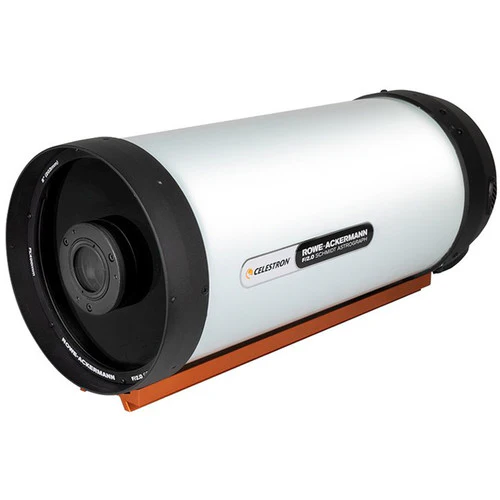
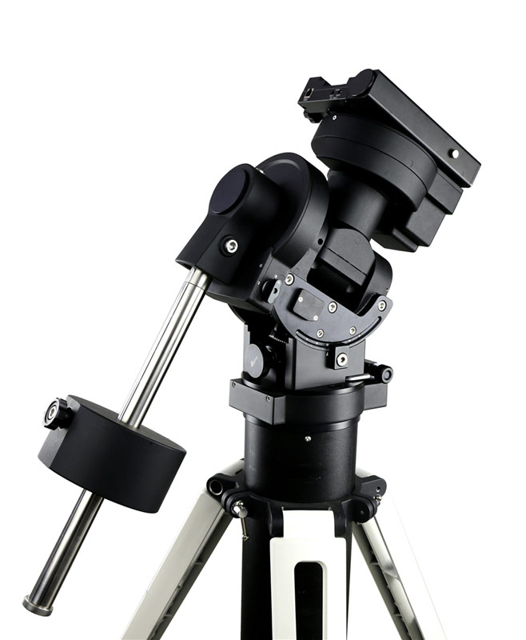
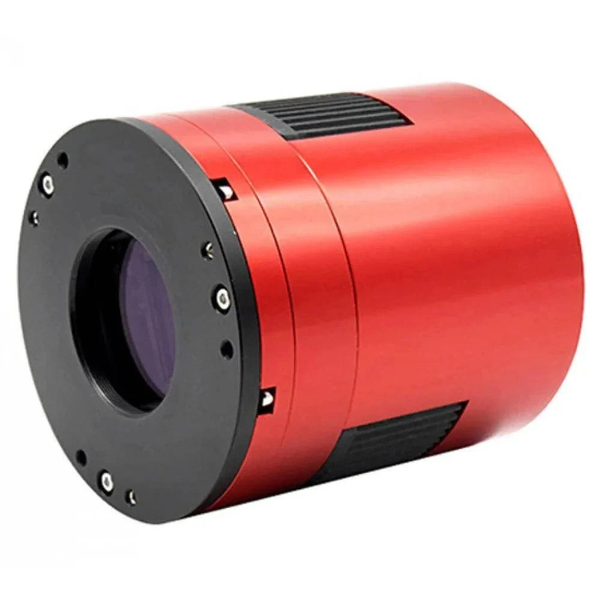

# 🌌 Facilities at UPES Astronomy Department

Explore the cutting-edge facilities that empower our students and researchers to delve into the mysteries of the cosmos.

---

## 🔭 In-house Telescope

  <figure style="text-align: center;">
    
    <figcaption style="margin-top: 10px; font-size: 0.9em; color: #555;">Celestron Schmidt-Cassegrain OTA</figcaption>
  </figure>
  <figure style="text-align: center;">
    
    <figcaption style="margin-top: 10px; font-size: 0.9em; color: #555;">iOptron German Equatorial Mount</figcaption>
  </figure>

### **Telescope Specifications**
- **Optical Design:** Schmidt-Cassegrain  
- **Aperture:** 203 mm  
- **Focal Length:** 2032 mm  
- **Focal Ratio:** f/10  
- **Resolution:** Rayleigh 0.69", Dawes 0.57"  
- **Limiting Magnitude:** 14  
- **Light Gathering Power:** 843×  
- **Weight:** 5.67 kg  

---

## 📷 In-house CCD Camera

Our imaging is powered by the **ZWO ASI2600MC Pro**, a high-performance cooled color CMOS camera.

<figure style="text-align: center;">
  
  <figcaption style="margin-top: 10px; font-size: 0.9em; color: #555;">ZWO ASI2600MC Pro CCD Camera</figcaption>
</figure>

### **Camera Specifications**
- **Sensor:** Sony IMX571 CMOS (APS-C)  
- **Resolution:** 26 MP (6248 × 4176)  
- **Pixel Size:** 3.76 μm  
- **Cooling:** ΔT = 35°C below ambient  
- **Dynamic Range:** 14 stops  
- **Weight:** 700 g  

---

## 🏠 Proposed Observation Dome

A **3-meter automated observation dome** is under development to house our telescope system.

<!--  -->

### **Dome Specifications**
- **Diameter:** 3 meters  
- **Slit Width:** 1 meter  
- **Rotation:** Manual and motorized (planned)  
- **Construction:** Aluminum and fiberglass  
- **Automation:** Weather sensors and remote control (planned)  

---
