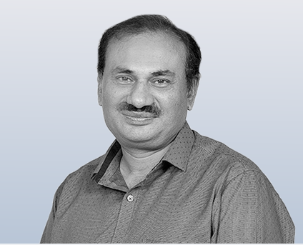

# Meet Our Faculty

<h2 id="PSRAWAT">Dr. Prashant S. Rawat</h2>

  

    <strong>Key Research Areas:</strong>
    <ul>
      <li>Laboratory Astrophysics: Experiments related to planetary and space physics.</li>
      <li>Solar Physics: Collaboration with ARIES on the Coronal heating problem.</li>
    </ul>
  

  

<h2 id="BALENDRA">Dr. Balendra Pratap Singh</h2>

  

    <strong>Key Research Areas:</strong>
    <ul>
      <li>Black Hole Physics: Study of black hole shadow, thermodynamic properties, and quasinormal modes.</li>
      <li>Solar Physics: Solar flares and Coronal Mass Ejection.</li>
    </ul>
    <strong>Publications:</strong>
    <ul>
      <li><em>"On the Formation Height of Low-corona and Chromospheric Channels of the Atmospheric Imaging Assembly (AIA) onboard the Solar Dynamics Observatory (SDO)"</em>, The Astrophysical Journal, 2024. DOI: <a href="0 https://doi.org/10.3847/1538-4357/ad7d8c" target="_blank" rel="noopener noreferrer" style="color: blue; text-decoration: underline;">:10.3847/1538-4357/ad7d8c</a></li>
      <li><em>"Height-Dependent Slow Magnetoacoustic Wave Amplitude and Energy Flux in Sunspot Atmospheres"</em>, Monthly Notices of the Royal Astronomical Society, 2025. DOI: <a href="https://arxiv.org/pdf/2504.15030" target="_blank" rel="noopener noreferrer">10.48550/arXiv.2504.15030</a></li>      
    </ul>
  

  

<h2 id="NITESH"><a href="https://niteshchandra039.github.io/" target="_blank" style='font-size: 1em; color: black; text-decoration: none; font-weight: bold; text-align: center; display: block; margin: 10px 0 20px 0; padding: 5px 10px; background-color: #f0f8ff; border-radius: 5px; width: fit-content; max-width: 100%; box-shadow: 0 2px 4px rgba(0, 0, 0, 0.1);'>Dr. Nitesh Kumar</a></h2>

  

    <strong>Key Research Areas:</strong>
    <ul>
      <li>Stellar Astrophysics: Study of stellar structure, evolution, and modeling.</li>
      <li>Galactic Globular Clusters: Observational and theoretical studies of globular clusters.</li>
      <li>Variable Stars: Analysis of light curves and variability mechanisms.</li>
      <li>RR Lyrae Stars: Multiwavelength photometry and pulsation modeling.</li>
      <li>Stellar Evolution and Modeling: Computational approaches to stellar interiors and evolution.</li>
    </ul>
    <strong>Publications:</strong>
    <ul>
      <li><em>"Physical parameters of stars in NGC 6397 using ANN-based interpolation and full spectrum fitting"</em>, New Astronomy, 2025. DOI: <a href="https://doi.org/10.1016/j.newast.2025.102416" target="_blank" rel="noopener noreferrer" style="color: blue; text-decoration: underline;">10.1016/j.newast.2025.102416</a></li>
      <li><em>"Multiwavelength photometric study of RR Lyrae variables in the globular cluster NGC 5272 (Messier 3)"</em>, Monthly Notices of the Royal Astronomical Society, May 2024. DOI: <a href="https://doi.org/10.1093/mnras/stae1334" target="_blank" rel="noopener noreferrer">10.1093/mnras/stae1334</a></li>
      <li><em>"Predicting light curves of RR Lyrae variables using artificial neural network-based interpolation of a grid of pulsation models"</em>, Monthly Notices of the Royal Astronomical Society, March 2023. DOI: <a href="https://doi.org/10.1093/mnras/stad937" target="_blank" rel="noopener noreferrer">10.1093/mnras/stad937</a></li>
    </ul>
  

  

<h2 id="PRINCE">Dr. Prince Sharma</h2>

  

    <strong>Key Research Areas:</strong>
    <ul>
      <li>Compact Object Astrophysics: Studying neutron stars and black holes in X-ray binary systems.</li>
      <li>X-ray Spectroscopy: Analyzing high-energy spectra to understand accretion and emission processes.</li>
      <li>Timing Analysis: Investigating variability and pulsations to probe spin and accretion dynamics.</li>
      <li>Cyclotron Line Studies: Using spectral features to measure magnetic fields in neutron stars.</li>
      <li>Broadband X-ray Observations: Combining data from multiple missions to study accreting systems.</li>
    </ul>
    <strong>Publications:</strong>
    <ul>
      <li><em>Timing analysis of Be/X-ray transient 4U 0115+63 during Type II outburst of 2023 using NuSTAR observations</em>, Advances in Space Research, 2024. DOI: <a href="https://doi.org/10.1016/j.asr.2024.10.021" target="_blank" rel="noopener noreferrer">10.1016/j.asr.2024.10.021</a></li>
      <li><em>Torque reversal and cyclotron absorption feature in HMXB 4U 1538-522</em>, Monthly Notices of the Royal Astronomical Society, 2023. DOI: <a href="https://doi.org/10.1093/mnras/stad1285" target="_blank" rel="noopener noreferrer">10.1093/mnras/stad1285</a></li>
    </ul>
  

  

<h2 id="ARKA">Dr. Arka Chatterjee</h2>

  

    <strong>Key Research Areas:</strong>
    <ul>
      <li>X-ray Images of Black Holes.</li>
      <li>Timing Analysis of Black Hole Accretion.</li>
      <li>Active Galactic Nuclei.</li>
    </ul>
    <strong>Publications:</strong>
    <ul>
      <li><em>"Images and spectral properties of two-component advective flows around black holes: effects of photon bending"</em>, Monthly Notices of the Royal Astronomical Society, 2017. DOI: <a href="https://doi.org/10.1093/mnras/stw2975" target="_blank" rel="noopener noreferrer">10.1093/mnras/stw2975</a></li>
      <li><em>"Time-domain variability properties of XTE J1650-500 during its 2001 outburst: Evidence of disc-jet connection"</em>, Monthly Notices of the Royal Astronomical Society, 2020. DOI: <a href="https://doi.org/10.1093/mnras/staa2263" target="_blank" rel="noopener noreferrer">10.1093/mnras/staa2263</a></li>
    </ul>
  

  

<h2 id="RAJU">Dr. Raju Roychowdhury</h2>

<strong>Key Research Areas:</strong>
<ul>
  <li>Extremal Black Holes and Attractor Mechanism.</li>
  <li>Gauge/Gravity Correspondence.</li>
  <li>Gravitino and Cosmology.</li>
</ul>
<strong>Publication Journals:</strong>
<ul>
  <li>Journal of High Energy Physics (JHEP).</li>
  <li>General Relativity and Gravitation (GRG).</li>
  <li>International Journal of Modern Physics A (IJMPA).</li>
</ul>

