# 📸 Gallery

Welcome to our Astronomy & Astrophysics Gallery. Browse event-wise highlights and click any image to open it in a focused lightbox view.

  <button class="filter-btn active" data-filter="all">All</button>
  <button class="filter-btn" data-filter="nwdsa">NWDSA 2026</button>
  <button class="filter-btn" data-filter="nso">Night Sky Observation 2025</button>
  <button class="filter-btn" data-filter="space-day">National Space Day 2025</button>
  <button class="filter-btn" data-filter="aries">ARIES Trip 2025</button>
  <button class="filter-btn" data-filter="lecture-series">Weekly Lecture Series</button>

---

## <a href="#" class="event-header" data-section="nwdsa">🎓 National Workshop on Data Science in Astronomy (NWDSA 2026)</a>

February 2026 • UPES, Dehradun

  

    
    
    
    
    
    
    
    
    
    
    
    
    
    
    
    
    
    
    
    
    
    
    <a href="assests/images/NWDSA/UPES-2.JPG" target="_blank" class="gallery-item">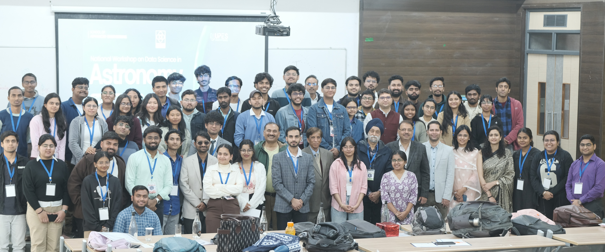</a>
  

---

## <a href="#" class="event-header" data-section="nso">🌙 Night Sky Observation 2025</a>

2 December 2025 • Guided night sky observations

  

    <a href="assests/images/NSO/DSCF8471.jpg" target="_blank" class="gallery-item">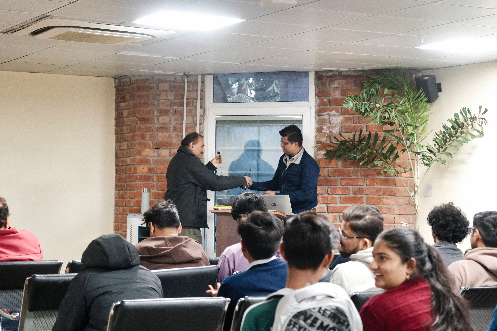</a>
    <a href="assests/images/NSO/DSCF8474.jpg" target="_blank" class="gallery-item">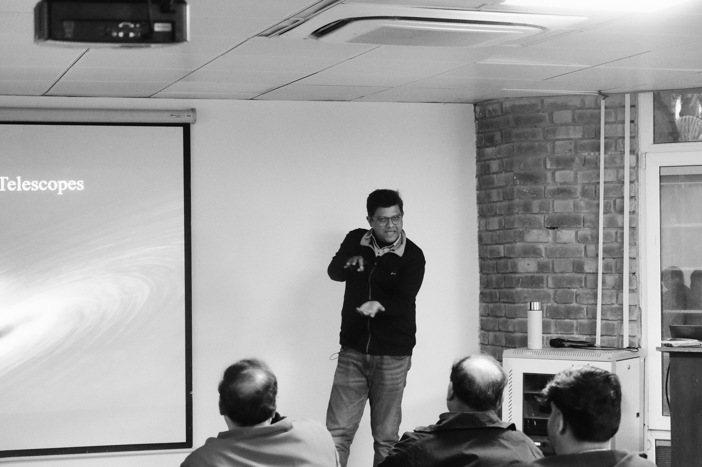</a>
    <a href="assests/images/NSO/DSCF8484.jpg" target="_blank" class="gallery-item">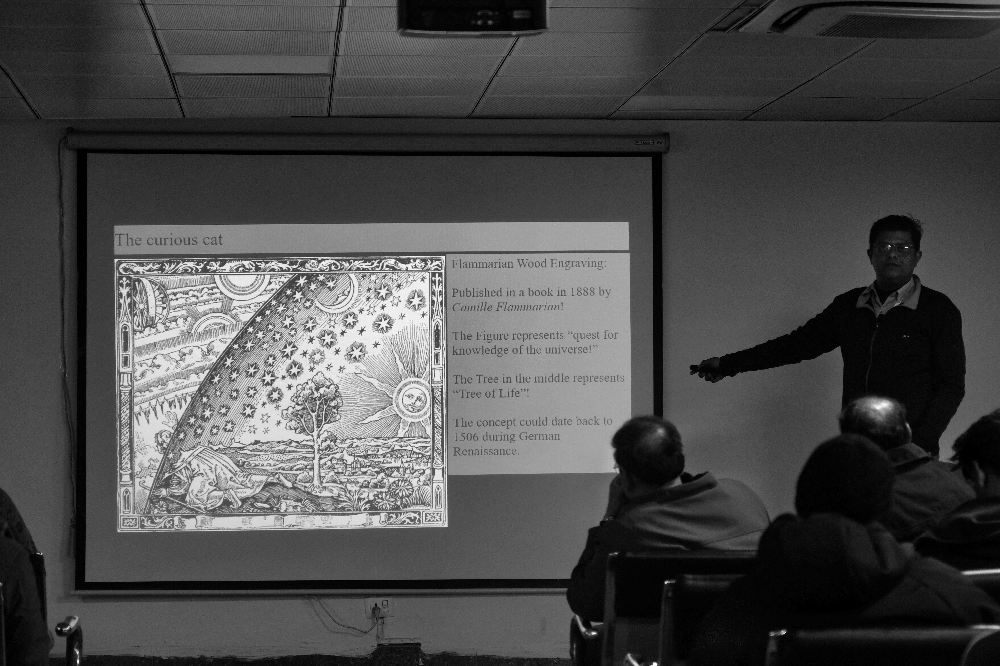</a>
    <a href="assests/images/NSO/DSCF8512.jpg" target="_blank" class="gallery-item">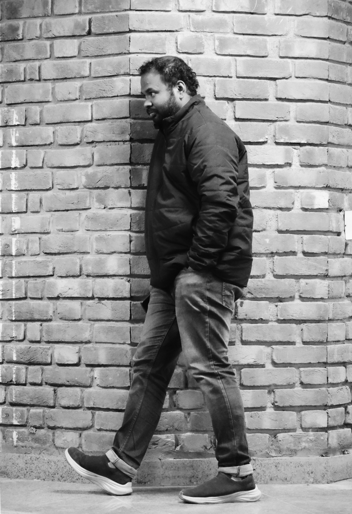</a>
    <a href="assests/images/NSO/DSCF8525.jpg" target="_blank" class="gallery-item">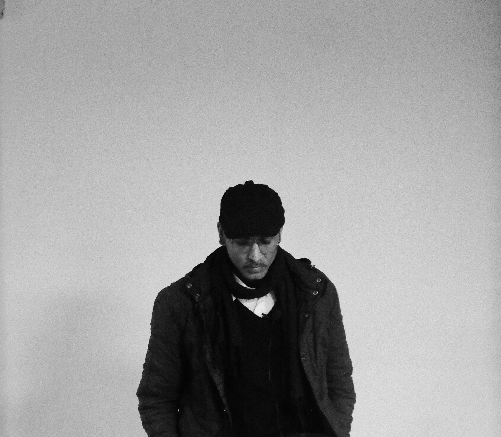</a>
    
    
    
    
    
    <a href="assests/images/NSO/DSCF8658.jpg" target="_blank" class="gallery-item">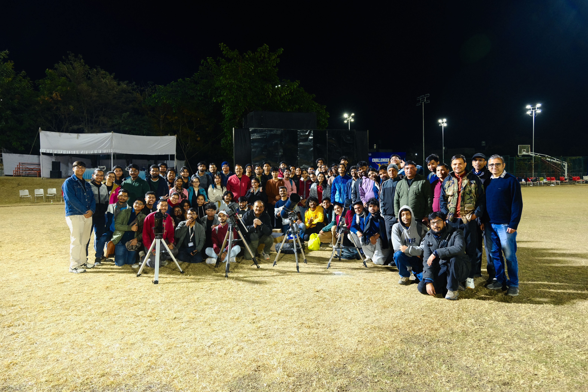</a>
    <a href="assests/images/NSO/DSCF8659.jpg" target="_blank" class="gallery-item">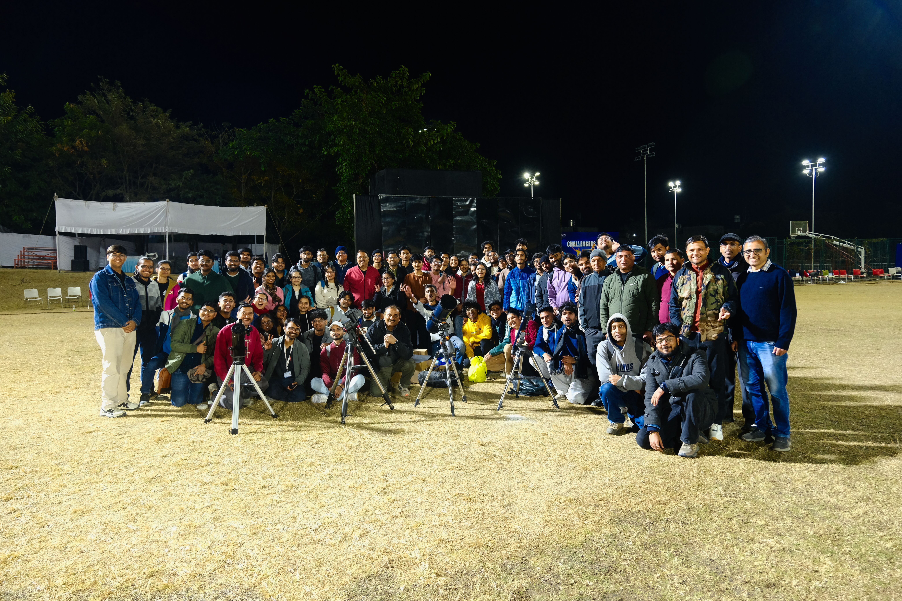</a>
    <a href="assests/images/NSO/DSCF8697.jpg" target="_blank" class="gallery-item">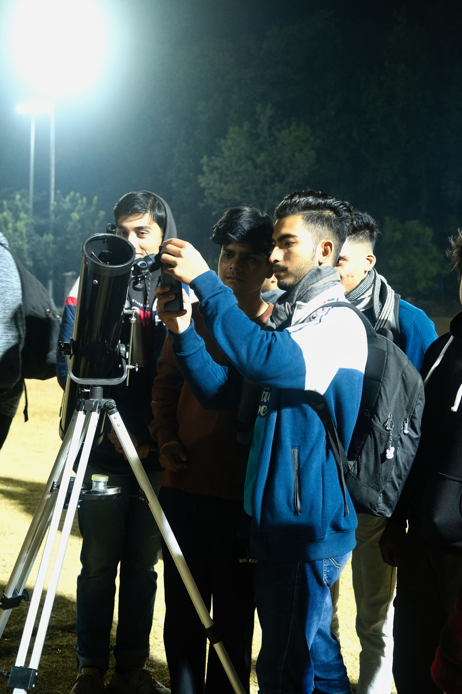</a>
    <a href="assests/images/NSO/DSCF8705.jpg" target="_blank" class="gallery-item">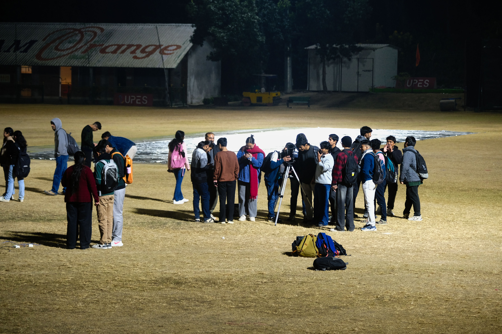</a>
    <a href="assests/images/NSO/DSCF8723.jpg" target="_blank" class="gallery-item">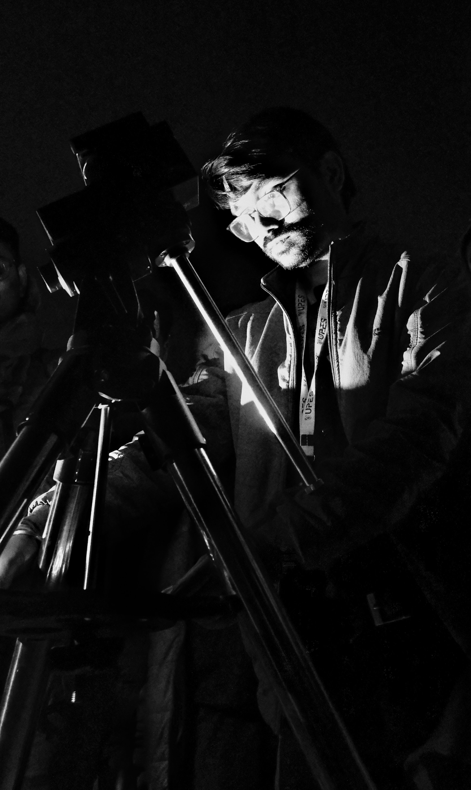</a>
  

---

## <a href="#" class="event-header" data-section="space-day">🛰️ National Space Day 2025</a>

22 August 2025 • Special lecture by Prof. Varun Sheel

  

    
    
    
    
  

---

## <a href="#" class="event-header" data-section="aries">🌄 ARIES Trip 2025</a>

April 2025 • Student academic visit to ARIES, Nainital

  

    
    
    
    
    
    
    
    
    
    
    
    
  

---

## <a href="#" class="event-header" data-section="lecture-series">🌟 Weekly Lecture Series on Astrophysics</a>

March 2025 • Ongoing student lecture series

  

    
    
    
    
  

---

