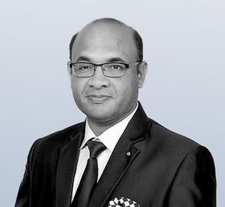
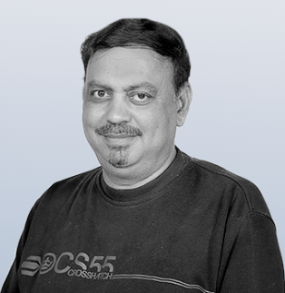
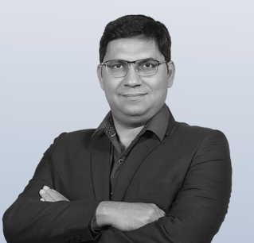
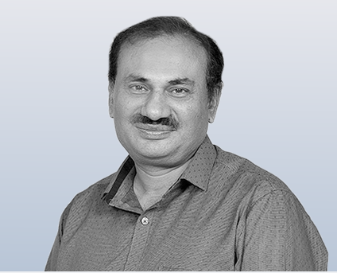
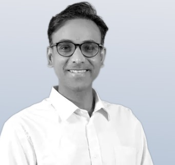
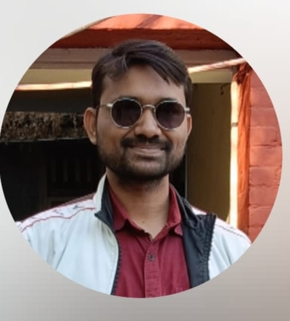
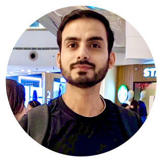
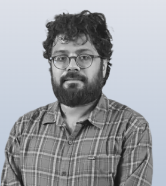
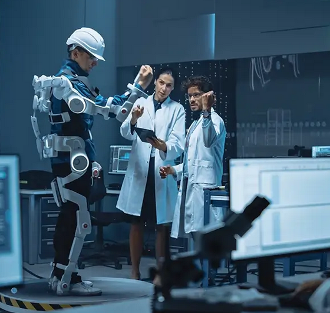

  <aside style="width: 370px; min-width: 260px; max-width: 98vw; background: #f7fafc; border: 1.5px solid #dbeafe; border-radius: 14px; box-shadow: 0 2px 12px rgba(0,0,0,0.07); padding: 22px 18px 18px 18px;">
    <h2 style="font-size: 1.3em; color: #1a5276; margin-top: 0; margin-bottom: 12px; letter-spacing: 1px;">📰 Latest</h2>
    

      <strong style="color: #003366;">Global Headlines</strong>
      <ul style="list-style: disc inside; font-size: 1em; color: #234; margin: 8px 0 0 0; padding: 0;">
        <li>
          <a href="https://www.nasa.gov/press-release/nasa-s-euclid-mission-releases-first-science-images" target="_blank" rel="noopener" style="color: #1a5276; text-decoration: underline;">
            NASA's Euclid Mission Releases First Science Images
          </a>
        </li>
        <li>
          <a href="https://www.esa.int/Science_Exploration/Space_Science/Black_hole_eats_star" target="_blank" rel="noopener" style="color: #1a5276; text-decoration: underline;">
            ESA: Black Hole Eats Star in Distant Galaxy
          </a>
        </li>
        <li>
          <a href="https://www.nature.com/articles/d41586-024-01234-5" target="_blank" rel="noopener" style="color: #1a5276; text-decoration: underline;">
            Astronomers Detect Most Distant Fast Radio Burst Yet
          </a>
        </li>
      </ul>
    

    

      <strong style="color: #003366;">Department Updates</strong>
      <ul style="list-style: disc inside; font-size: 1em; color: #234; margin: 8px 0 0 0; padding: 0;">
        <li>
          Upcoming: <b>Lunar Eclipse</b> – September 2025.
        </li>
        <li>
          We're launching a dedicated Astronomy Club. <b>Help us name the club!</b> Submit your creative suggestions at our upcoming event. Stay tuned for details.
          [New!]
             
        </li>        
        <li>
          Workshop on Data Science in Astronomy: Feb 2026. (<a href="workshop.html" style="color: #1a5276; text-decoration: underline;">Details</a>)
        </li>
      </ul>
    

  </aside>

# Astronomy & Astrophysics at UPES

### A Specialized Division within the Department of Physics, Applied Science Cluster, School of Advanced Engineering

At UPES, our Astronomy and Astrophysics division stands as a vibrant center for students passionate about exploring the universe's mysteries. Rooted in fundamental physics and driven by the endless fascination of space, we offer a thorough educational experience that blends theoretical knowledge, observational skills, and innovative astrophysical research.

We foster a setting where learners confront big questions, from the formation of stars and galaxies to the detection of gravitational waves and exoplanets. Our programs establish a strong base in both traditional and modern physics, while providing the hands-on tools and methods used by astronomers worldwide.

> “Astronomy compels the soul to look upward and leads us from this world to another.” — Plato

The curriculum delves into topics like celestial mechanics, cosmology, stellar evolution, galactic astronomy, and advanced observational techniques. Students develop key abilities in telescope handling, image processing, and data analysis with Python, nurturing both scientific understanding and technical proficiency.

With a focus on experiential learning, we host workshops, stargazing events, guest lectures, and visits to leading facilities such as ARIES, IUCAA, PRL, and the Devasthal Optical Telescope. These opportunities provide real-world research exposure, expert interactions, and training in observatory equipment and data management.

Backed by dedicated, research-oriented faculty, students are inspired to innovate and pursue internships, fellowships, and further studies. We encourage a collaborative culture that embraces interdisciplinary discovery and creativity.

Whether you're drawn to unraveling black hole enigmas, advancing space exploration, or broadening your cosmic perspective, our Astronomy & Astrophysics program at UPES invites you to reach for the stars.

---

## What We Offer

- **Undergraduate & Postgraduate Programs in Physics**  
  Immerse yourself in Astronomy and Astrophysics through specialized degree options, including B.Sc. (Hons.) Physics and M.Sc. Physics, featuring practical training in data analysis, simulations, and observational astronomy.

- **Research Opportunities in Astrophysics**  
  Participate in meaningful projects alongside faculty and partners from institutions like ARIES, IUCAA, and PRL, concentrating on fields such as cosmology and high-energy astrophysics.

- **Sky-Gazing & Workshops**  
  Join public outreach, night-sky observations, and interactive sessions with department telescopes to bridge theoretical concepts with actual celestial events.

- **Academic Excellence and Mentorship**  
  Gain insights from leading researchers in areas like X-ray accretion, AI-driven stellar analysis, and theoretical black hole physics, supported by visiting scientists and an emphasis on interdisciplinary development.

---

<!-- Leadership Section -->
<section id="leadership-section" style="padding: 60px 20px; background: #eaf6ff;">
  <h2 style="text-align:center; font-size: 2em; color: #002855;">Leadership</h2>
  

    <!-- Cluster Head -->
    

      
      <h3 style="color: #002855;">Prof. Ranjeet Kumar Brajpuriya</h3>
      
<strong>Cluster Head, Applied Science Cluster</strong>

      
Prof. Ranjeet has more than 20 years of research and teaching experience. Prof. Ranjeet has undertaken post-doctoral work both in India and abroad. He is a recipient of several national and international fellowships, including the esteemed ENEA & ICTP International Research Fellowships in Italy.

      <a href="faculty.html#RANJEET" class="read-more-button" style="color:rgb(0, 0, 0); text-decoration: none; font-weight: bold;">View Profile →</a>
    

    <!-- Program Lead -->
    

      
      <h3 style="color: #002855;">Prof. Rajeev Gupta</h3>
      
<strong>Program Lead, Department of Physics</strong>

      
Prof. Rajeev Gupta is a distinguished academician, member of several scientific and educational societies, and editor/reviewer for leading international journals. He has authored books on Nanoscience, Solar Photovoltaics, Electronics Engineering and Solid-State Devices.

      <a href="faculty.html#RAJEEV" class="read-more-button" style="color:rgb(0, 0, 0); text-decoration: none; font-weight: bold;">View Profile →</a>
    

    

      
      <h3 style="color: #33c99cff;">Prof. Santosh Dubey</h3>
      
<strong>Former Lead, Department of Physics</strong>

      
Prof. Santosh Dubey, former Program Lead, was instrumental in establishing Astronomy and Astrophysics as a core domain. He earned his MS and PhD in Computational Science (Materials Science) from Florida State University, USA, and is recognized for his pioneering work on radiation–materials interactions through modeling and experimentation.

      <a href="faculty.html#SANTOSH" class="read-more-button" style="color:rgb(0, 0, 0); text-decoration: none; font-weight: bold;">View Profile →</a>
    

  

</section>

---
<section id="faculty-section" style="padding: 60px 20px; background: #f5f5f5;">
  <h2 style="text-align:center; font-size: 2em;">Faculty</h2>
  

    

      

        
        <h3>Dr. Prashant S. Rawat</h3>
        
<strong>Sr. Associate Professor, Applied Science Cluster</strong>

        
Dr. Rawat earned his doctoral degree from the esteemed Physical Research Laboratory (PRL), Ahmedabad....

        <a href="faculty.html#PSRAWAT" class="read-more-button">Read more →</a>
      

      

        
        <h3>Dr. Balendra P. Singh</h3>
        
<strong>Assistant Professor, Applied Science Cluster</strong>

        
Balendra P. Singh specializes in Astrophysics and Astronomy and received his PhD from the Center for Theoretical Physics...

        <a href="faculty.html#BALENDRA" class="read-more-button">Read more →</a>
      

      

        
        <h3>Dr. Nitesh Kumar</h3>
        
<strong>Assistant Professor, Applied Science Cluster</strong>

        
Dr. Nitesh has attended Hansraj College and obtained his Ph. D. in Automated Analysis of Stellar Photometric and Spectroscopic Data from the University of Delhi....

        <a href="faculty.html#NITESH" class="read-more-button">Read more →</a>
      

      

        
        <h3>Dr. Prince Sharma</h3>
        
<strong>Assistant Professor, Applied Science Cluster</strong>

        
Dr. Prince Sharma is an alumnus of Kirorimal College and has done his Doctorate from University of Delhi....

        <a href="faculty.html#PRINCE" class="read-more-button">Read more →</a>
      

      

        
        <h3>Dr. Arka Chatterjee</h3>
        
<strong>Assistant Professor, Applied Science Cluster</strong>

        
Dr. Arka Chatterjee is an Astrophysicist with a PhD in Theoretical Physics from the University of Calcutta....

        <a href="faculty.html#ARKA" class="read-more-button">Read more →</a>
      

      

        
        <h3>Dr. Raju Roychowdhury</h3>
        
<strong>Associate Professor, Applied Science Cluster</strong>

        
Dr. Roychowdhury has obtained his Ph. D. from University of Naples, Italy in the field of Black-Holes in Supergravity....

        <a href="faculty.html#RAJU" class="read-more-button">Read more →</a>
      

      <!-- All Department Faculty Card -->
      

        
        <h3>Department Faculty</h3>
        
<strong>Department of Physics, School of Advanced Engineering</strong>

        

          Discover more about the diverse and accomplished faculty members of the Department of Physics. 
        

        <a href="faculty.html#all-faculty" class="read-more-button">
         More →</a>
      

    

    <button id="prev-btn" class="carousel-btn prev">&#10094;</button>
    <button id="next-btn" class="carousel-btn next">&#10095;</button>
  

</section>

---

## 🗞 Recent Highlights

- 🌠 *August 2025:* Public Lecture on the occasion of the 2nd National Space Day by *Prof. Varun Sheel* (Head, Planetary Science Division, PRL).
- ✅ *April 2025:* Student visit to ARIES, Nainital.  
- ➡️ See more in [Recent Activities](activities.md)

---

## 🌟 Join Us

Applications are open for the **B.Sc. (Hons.) Physics** and **M.Sc. Physics** programs.  
Build your career in **Astronomy** and **Astrophysics**.

🔗 [Learn about our academic programs](programs.md)

  

  <!-- Latest Section Box -->
  <aside style="flex: 1 1 320px; min-width: 280px; max-width: 370px; background: #f7fafc; border: 1.5px solid #dbeafe; border-radius: 14px; box-shadow: 0 2px 12px rgba(0,0,0,0.07); padding: 22px 18px 18px 18px; margin-top: 12px;">
    <h2 style="font-size: 1.3em; color: #1a5276; margin-top: 0; margin-bottom: 12px; letter-spacing: 1px;">📰 Latest</h2>
    

      <strong style="color: #003366;">Global Headlines</strong>
      <ul style="list-style: disc inside; font-size: 1em; color: #234; margin: 8px 0 0 0; padding: 0;">
        <li>
          <a href="https://www.nasa.gov/press-release/nasa-s-euclid-mission-releases-first-science-images" target="_blank" rel="noopener" style="color: #1a5276; text-decoration: underline;">
            NASA's Euclid Mission Releases First Science Images
          </a>
        </li>
        <li>
          <a href="https://www.esa.int/Science_Exploration/Space_Science/Black_hole_eats_star" target="_blank" rel="noopener" style="color: #1a5276; text-decoration: underline;">
            ESA: Black Hole Eats Star in Distant Galaxy
          </a>
        </li>
        <li>
          <a href="https://www.nature.com/articles/d41586-024-01234-5" target="_blank" rel="noopener" style="color: #1a5276; text-decoration: underline;">
            Astronomers Detect Most Distant Fast Radio Burst Yet
          </a>
        </li>
      </ul>
    

    

      <strong style="color: #003366;">Department Updates</strong>
      <ul style="list-style: disc inside; font-size: 1em; color: #234; margin: 8px 0 0 0; padding: 0;">
        <li>
          New!
          We're launching a dedicated Astronomy Club. <b>Help us name the club!</b> Submit your creative suggestions at our upcoming event. Stay tuned for details.
        </li>
        <li>
          Upcoming: <b>Sky-Gazing Night</b> – August 2025. Open to all students. Details soon.
        </li>
        <li>
          Recent: Students visited ARIES, Nainital (April 2025).
        </li>
        <li>
          Workshop on Data Science in Astronomy: Feb 2026. <a href="workshop.html" style="color: #1a5276; text-decoration: underline;">Details</a>
        </li>
      </ul>
    

  </aside>

---

> _"Somewhere, something incredible is waiting to be known."_  
> — Carl Sagan